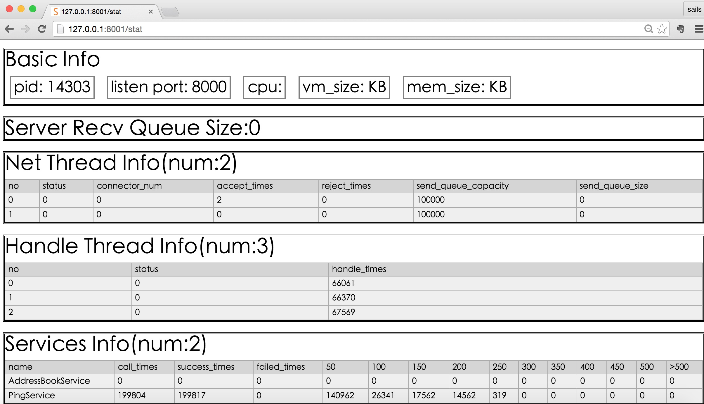

saf
===

saf application framework

## 特点 ##

    1:基于google protobuf的rpc框架
    2:内置简单的http server用于查看系统状态
    3:模块化的管理,只用在lib中增加动态库就可以达到增加rpc service的目的

## 结构 ##

                                                                 +--------------+
    +-----------+      +------------+                           /|              |
    |           |      |            |                          / | Handle Thread| --->-
    |Net Thread \----->|   Decode   |\                        /  +--------------+     |
    +-----------+\     +------------+ \  +-----------------+ /   +--------------+     |
                  \                    \>|                 |/    |              |     |
                   \                   />|Dispacher Thread +-----+ Handle Thread+---->+
    +-----------+   \  +------------+ /  +-----------------+\    +--------------+     |
    |           |    \ |            |/                       \   +--------------+     |
    |Net Thread +----+>+   Decode   /                         \  |              |     |
    +-----------+     \+------------+                          \ | Handle Thread|     |
              \        \                                         +---------+----+     |
               \        \                                                  |          |
                \        \                                                 |          |
                 \     +--\---------+                                      |          |
                  \    |            |<-------------------------------------+          |
                   \   |   Encode   |                                                 |
                    \  +------------+                                                 |
                     \ +------------+                                                 |
                      \|            |                                                 |
                       \   Encode   +<------------------------------------------------+
                       +------------+

## 编译例子 ##

1:下载源码,它依赖与sails公共库:

    git clone --recursive https://github.com/sails/saf.git
2:执行编辑脚本:

    ./build.sh
3:编译测试样例:

    cd example
    ./build_test.sh
4:运行测试,比如运行echo_sync:

    ./src/server
    ./example/echo_sync/client

5:增加子模块,配置conf/sails.json:
在modules里增加一行,name是子模块名,path是子模块动态库的路径

## 性能 ##

### 测试一 ###

笔记本:
Intel(R) Core(TM) i5-4278U CPU @ 2.60GHz, cpu num:1, cpu cores:1
memory:1G
服务端和客户端都运行在这台电脑上

    | server handle threads | client call threads | earch threads call num | run time  |
    |-----------------------+---------------------+------------------------+-----------|
    |                     1 |                   1 |                 100000 | 0m4.768s  |
    |                     1 |                   5 |                 100000 | 0m18.860s |
    |                     1 |                  10 |                 100000 | 0m37.767s |
    |                     2 |                   1 |                 100000 | 0m4.741s  |
    |                     2 |                   5 |                 100000 | 0m18.597s |
    |                     2 |                  10 |                 100000 | 0m39.193s |

因为是单核，所以当服务器开多个线程时性能没有得到提升。
单核情况下达到2.5w tps.因为客户端和服务器在同一台电脑上,服务端进程的cpu只用到了70%左右,所以实际结果比测试结果会更高.
(单独测试protobuf时，10w次序列化和反序列化用时2s)

## 统计 ##
内置http服务器的默认绑定在端口8001上,所以可以通过输入localhost:8001/stat来查看统计信息:

